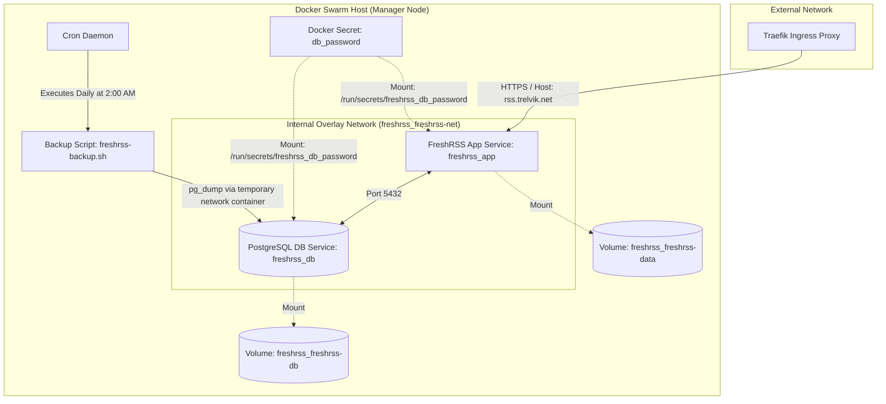

# FreshRSS Infrastructure as Code (IaC) Deployment

This repository contains the Infrastructure as Code (IaC) configuration for deploying and maintaining a secure, production-grade **[FreshRSS](https://freshrss.org/)** instance on a self-hosted Linux server.

The architecture has been migrated from a legacy, ad-hoc setup to a modern, declarative stack utilizing **Ansible** for host provisioning and system configuration, and **Terraform** for Docker Swarm orchestration.

---

## 🏗️ Architecture Overview

The FreshRSS deployment uses a containerized multi-service stack running on Docker Swarm. 



### Stack Components

1. **FreshRSS Application Service ([freshrss_app](file:///home/ttrelvik/services/freshrss/terraform/main.tf#L123-L240))**
   - **Image**: `freshrss/freshrss:1.29.1` (configured via [variables.tf](file:///home/ttrelvik/services/freshrss/terraform/variables.tf#L31-L35))
   - **Role**: Serves the FreshRSS web interface and runs background cron tasks for feed updates (configured for every 15 minutes via `CRON_MIN=*/15`).
   - **Placement**: Constrained to run on Swarm `manager` nodes to access persistent volumes and secrets.
2. **PostgreSQL Database Service ([freshrss_db](file:///home/ttrelvik/services/freshrss/terraform/main.tf#L60-L120))**
   - **Image**: `postgres:16` (configured via [variables.tf](file:///home/ttrelvik/services/freshrss/terraform/variables.tf#L37-L41))
   - **Role**: Dedicated relational database for storing FreshRSS system state, user data, feeds, and articles.
   - **Placement**: Constrained to run on Swarm `manager` nodes.
3. **Ansible Configuration Management**
   - Prepares the target host's directories, validates Docker services, installs a robust backup script, and configures cron tasks.
4. **Terraform Resource Orchestration**
   - Declaratively provisions Swarm services, overlay networks, volumes, and secrets, ensuring state consistency and easy scaling.

---

## 🛠️ Prerequisites

Before deploying or running updates, ensure the following prerequisites are met:

### Control Node Requirements
* **Ansible** (>= 2.15)
* **Terraform** (>= 1.2.0)
* **SSH access** to the target host with sudo privileges.

### Target Host Requirements
* **Docker Engine** installed and running.
* **Docker Swarm Mode** initialized:
  ```bash
  docker swarm init
  ```
* **Traefik Ingress Controller** running on the cluster, connected to an external overlay network named `traefik-net`.
  * If this network does not exist yet, create it:
    ```bash
    docker network create --driver overlay traefik-net
    ```
* **DNS Record**: A record pointing your domain (`rss.trelvik.net`) to the Swarm manager's IP.

---

## 🚀 Deployment & Automation Instructions

### Step 1: Target Host Provisioning (Ansible)
First, execute the Ansible playbook to prepare the directories, verify Docker's health, and configure the backup system.

1. Navigate to the `ansible/` directory:
   ```bash
   cd ansible/
   ```
2. Run the playbook against your target inventory (default is configured for local connection on the host):
   ```bash
   ansible-playbook -i inventory.yml playbook.yml --ask-become-pass
   ```

### Step 2: Stack Infrastructure Provisioning (Terraform)
Once the host is prepared, Terraform is used to provision the Swarm secrets, networks, volumes, and deploy the services.

1. Navigate to the `terraform/` directory:
   ```bash
   cd ../terraform/
   ```
2. Copy the example variables file:
   ```bash
   cp terraform.tfvars.example terraform.tfvars
   ```
3. Open `terraform.tfvars` and configure the stack variables (which exclude sensitive credentials like the database password):
   ```hcl
   stack_name        = "freshrss"
   postgres_db       = "freshrss"
   postgres_user     = "freshrss_user"
   timezone          = "America/New_York"
   ```
4. Initialize Terraform and the required providers:
   ```bash
   terraform init
   ```
5. Apply the configuration. Because the database password (`postgres_password`) is treated as a sensitive secret, it is not stored on disk in plain text. Instead, you will be prompted to enter it securely during execution (or you can set the `TF_VAR_postgres_password` environment variable):
   ```bash
   terraform apply
   ```

---

## 🔍 Verifying Deployment & Health

To check the health and status of the deployed services in the Swarm cluster:

### Check Service Status
List all services running under the `freshrss` stack namespace:
```bash
docker service ls --filter label=com.docker.stack.namespace=freshrss
```
Alternatively, inspect the target services directly:
```bash
docker service ps freshrss_app
docker service ps freshrss_db
```

### Inspect Logs
To inspect output logs or troubleshoot service startup:
```bash
# View app logs
docker service logs -f freshrss_app

# View database logs
docker service logs -f freshrss_db
```

Once all replicas are healthy (`1/1`), the FreshRSS interface will be accessible at `https://rss.trelvik.net` via your Traefik ingress proxy.

---

## 🔒 Security & Hardening by Design

Security and privacy are baked directly into this deployment architecture:

* **Network Isolation**: The PostgreSQL database (`freshrss_db`) is entirely contained within the internal overlay network (`freshrss_freshrss-net`). It is unreachable from Traefik or any external client. The application container (`freshrss_app`) is multi-homed on both `traefik-net` (for web ingress) and `freshrss_freshrss-net` (for database queries).
* **Secret Management**: Plaintext database credentials are never stored in service environment variables. The password is created as a Docker secret (`freshrss_db_password_<hash>`) and mounted read-only to `/run/secrets/freshrss_db_password` in both containers. The entrypoint wrapper in `freshrss_app` reads this file dynamically at startup.
* **Volume and Backup Directory Protections**: The host directory for database backups (`/var/backups/freshrss`) is restricted to the root user with `0700` (`drwx------`) permissions.
* **Placement Restrictions**: Both database and application tasks are pinned to manager nodes (`node.role == manager`) to restrict where sensitive data volumes and Swarm secrets are resolved.

---

## 💾 Maintenance & Operations

### Updating FreshRSS & PostgreSQL Images
Because the infrastructure is declared via Terraform, image updates are managed by modifying variables:

1. Open `terraform/variables.tf` (or specify overriding variables in `terraform/terraform.tfvars`):
   ```hcl
   freshrss_image = "freshrss/freshrss:1.29.1" # Update tag here
   ```
2. Apply the changes:
   ```bash
   cd terraform/
   terraform apply
   ```
   Docker Swarm will perform a rolling update of the service with zero downtime.

### Database Backups
A daily cron job runs at **2:00 AM** to trigger the backup script deployed at `/usr/local/bin/freshrss-backup.sh`.

#### Manual Database Backup
To trigger a manual database backup, run the following command directly on the host machine:
```bash
sudo /usr/local/bin/freshrss-backup.sh
```
The script will perform a network-based `pg_dump` via a temporary container attached to `freshrss_freshrss-net` and fall back to local `docker exec` if the database is running on the local host node. Backups are stored in `/var/backups/freshrss/` and compressed (`.sql.gz`). Files older than 7 days are automatically purged.

#### Manual App Data Volume Backup
To create a backup of the persistent app configuration and subscription data:
```bash
docker run --rm \
  -v freshrss_freshrss-data:/volume:ro \
  -v /var/backups/freshrss:/backup \
  alpine tar -czf /backup/freshrss-data-backup-$(date +%Y%m%d).tar.gz -C /volume .
```

### Scaling the Services
If needed, you can temporarily scale the web interface replica count:
```bash
docker service scale freshrss_app=2
```
*Note: Due to volume mounting requirements on the single-node manager, the application is designed to run with a single manager replica under normal circumstances.*
